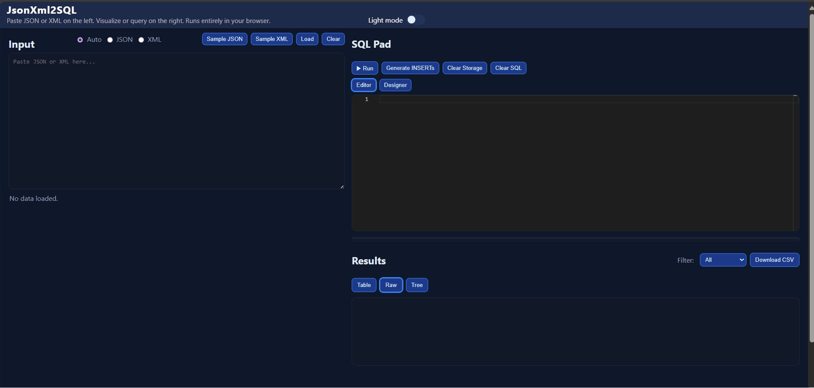

# JsonXml2SQL

Ever needed to run a simple query on a JSON or XML file and found yourself wrestling with heavyweight tools, ad‑hoc scripts, or risky online uploaders? Spinning up databases, wrangling schemas, or chaining jq/xq just to filter a few fields, join two arrays, or sort some rows feels disproportionate and slow. Sometimes you just want a fast, local way to ask basic questions of your data without setup, installs, or boilerplate.

Paste JSON or XML on the left. Visualize or run simple SQL-like queries on the right. Runs entirely in your browser.

## Demo preview

## Features

- Paste or drag-and-drop JSON or XML
- Auto-detects arrays anywhere under `data.*` and lists them as tables
- Three result views: Table, Raw (JSON), and Tree (collapsible with keyboard support)
- Multi-table overview when you run `SELECT * FROM data`
  - Per-table row counts and quick filter
  - Download visible data as CSV
- Monaco editor with SQL keyword, FROM-path, and field completions
- Theme toggle (light/dark), fixed toolbar, and responsive layout
- Generate INSERT statements from current results

## SQL support (lightweight engine)

The app includes a small SQL-like engine that works against the loaded JSON/XML.

Supported:

- SELECT list
  - Columns by name (e.g., `name`, `userId`)
  - Star `*` and qualified wildcards like `a.*` or `data.users.*`
  - Aliases via `AS` (e.g., `name AS user_name`)
  - Aggregates: `COUNT(*)`, `COUNT(col)`, `SUM(col)`, `MIN(col)`, `MAX(col)`, `AVG(col)`
- FROM
  - `FROM data` or any discovered array path under `data.*` (e.g., `FROM data.users`, `FROM data.orders`)
  - Aliases: `FROM data.users a`
- JOIN
  - `INNER JOIN`, `LEFT JOIN`, `RIGHT JOIN`, `FULL OUTER JOIN`
  - Equality ON conditions with aliases, e.g., `ON a.id = b.userId`
  - Dotted identifiers supported everywhere (`a.id`, `data.users.id`)
- WHERE
  - Comparisons: `=`, `!=`, `<`, `>`, `<=`, `>=`
  - Logical `AND`, `OR`
  - Literals: strings ('x'), numbers, `TRUE`, `FALSE`, `NULL`
- GROUP BY
  - With aggregates listed above
- ORDER BY
  - `ASC`/`DESC`
- LIMIT/OFFSET

Notes:
- XML is parsed via DOMParser and normalized. Attribute/child names are resolved case-insensitively in queries.
- JOIN value comparisons are number-aware (string "1" joins with number 1).

## Examples

- List everything detected:
  - `SELECT * FROM data`
- Simple projection:
  - `SELECT id, name FROM data.users ORDER BY id`
- LEFT JOIN:
  - `SELECT a.*, b.orderId FROM data.users a LEFT JOIN data.orders b ON a.id = b.userId`
- RIGHT/FULL OUTER JOIN:
  - `SELECT b.orderId, a.name FROM data.users a RIGHT JOIN data.orders b ON a.id = b.userId`
  - `SELECT a.name, b.orderId FROM data.users a FULL OUTER JOIN data.orders b ON a.id = b.userId`
- Aggregation:
  - `SELECT userId, COUNT(*) AS n, SUM(amount) AS total FROM data.orders GROUP BY userId ORDER BY total DESC`

## Troubleshooting

### WHERE clause: don't use FROM inside WHERE

If you see an error like "Invalid token in WHERE: unexpected keyword 'FROM'", it usually means the query has a clause keyword inside the WHERE expression. For example, this is invalid:

- Wrong: `SELECT * FROM data WHERE FROM data.orders.order = 101`

Correct forms depend on the data shape:

- XML where orders are under `<orders><order .../></orders>` (path is `data.orders.order`):
  - `SELECT * FROM data.orders.order WHERE orderId = 101`
- JSON where orders is an array at `data.orders`:
  - `SELECT * FROM data.orders WHERE orderId = 101`

For joins (e.g., filter by an order property while selecting users):

- `SELECT a.name, b.orderId FROM data.users a INNER JOIN data.orders b ON a.id = b.userId WHERE b.orderId = 101`

## Usage tips

- Use the Sample JSON/XML buttons to seed the editor, then click Load.
- Use the filter in Results to narrow the multi-table overview (from `SELECT * FROM data`).
- To export, use Download CSV.
- Generate INSERTs from current results with the toolbar button.

## Accessibility

- Tree view items are keyboard-toggleable (Enter/Space)
- Tabs and buttons have focus styles

## License

MIT (see repository).
